# Creating an AR Demo using Business Cards

This tutorial will show you how to create an augmented reality demo using Unity, Vuforia and your business card. I first created this demo just to learn a little more about this great Vuforia tool that works with Unity. However, I have had a lot of requests for the code. I thought it would be better to just give you the steps so you can recreate it yourself and then also have the knowledge how to modify and make it your own.

Here are the basic elements of the demo:

* [Unity](http://unity.com "Unity website") is a multiplatform engine and toolset mainly used for creating 2D and 3D games. However, it has been used in many different content applications from simulations, to architecture and engineering and more recently virtual reality and augmented reality.

* [Vuforia](http://vuforia.com "Vuforia AR platform website") is an augmented reality platform with 2D and 3D object recognition which allows you to manage a set of targets, load the targets to a device or database, and then build augmented experiences for when those targets are detected on camera.

* Scanned Images of my Business Card are used in this demo as the targets. When the Vuforia platform detects this business card in the field of view, we will render models relative to the business card in the video. I have two sides to my business card. One in English and one in Japanese. So each side can be detected and render a different model.

* To make things fun, I used animated 3D models available in the Unity Asset store. I found the models from [3D Brothers](http://www.3d-brothers.com/ "3D Brothers website") to be really great for this demo. Thanks to them for making some of their work free in the Unity Asset, for a hobbyist like me.

<iframe src="https://www.facebook.com/plugins/video.php?href=https%3A%2F%2Fwww.facebook.com%2Fdrewrobbins%2Fvideos%2F10154180704073689%2F&show_text=1&width=560" width="560" height="458" style="border:none;overflow:hidden" scrolling="no" frameborder="0" allowTransparency="true"></iframe>

[View a video of the demo on Facebook](https://www.facebook.com/drewrobbins/videos/10154180704073689/)

## Prequisites

The first thing is to make sure you have all the tools and assets you will need to begin the project. You will need to register to use both Unity and Vuforia. I did not include those steps below.

1. Download the [Unity toolset](http://unity3d.com/get-unity). If you are on Windows, you will need the 32-bit version in order to do previews of your work within the Unity tools. Vuforia preview does not work in the 64-bit version of Unity on Windows.

1. Download the [Vuforia platform](https://developer.vuforia.com/downloads/sdk) for Unity. Click the *Download for Unity* link and save the .unitypackage file to a local folder. We will use this file later during the tutorial.

1. Scan your business card or any flat paper or photo that has a high contrast pattern on it. When we use this later, you will get a rating of how "augmentable" is the image. In other words, how easy it is to detect the image in the camera field of view. Note that the resulting image file needs to be less than 2mb.

1. On the [Vuforia Developer Portal](https://developer.vuforia.com), click the *Develop* tab and make sure you are in the *License Manager*. Click *Add License Key*, enter an *Application Name* and select *Mobile* for Device and *Starter - No Charge* for License Key. Click Next and confirm the Developer Agreement. 

    [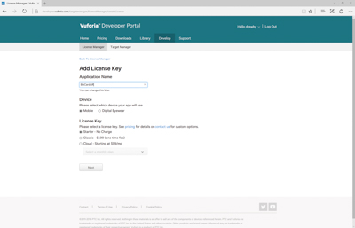](images/VuforiaLicense1-large.png)

1. Click the newly created License Key. Copy the key to a local text file and save for later.

1. Now move to the Target Manager tab. Create a new database by clicking *Add Database.* Give your database a name and select the *Device* type.

1. Click the name of your new Database to open it in Target Manager.

1. For each of your scanned images, click *Add Target*. Select *Single Image*. Choose the image file you scanned earlier. Choose a *Width* for how large the image will be in your Unity scene. I used a width of 5 for my business card images. Change the Name if you like, or keep the default. Click *Add*.

    [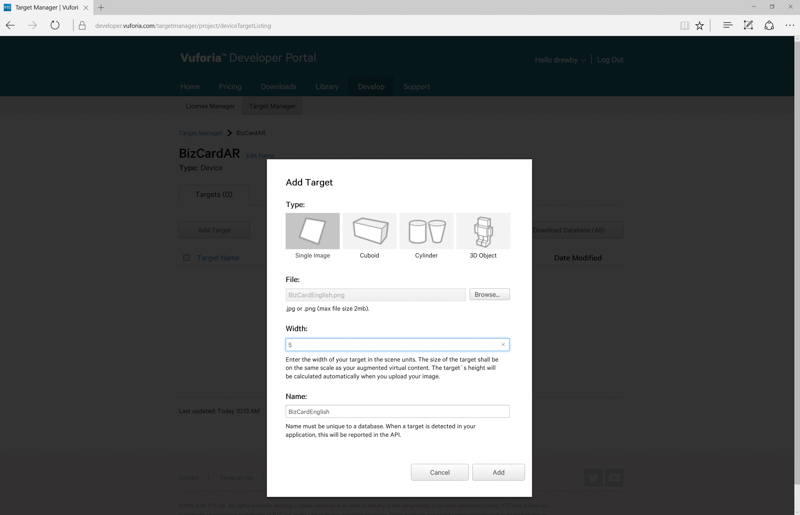](images/VuforiaAddTarget-large.png)

1. Note that there is a rating given to each of your targets. This 1-5 star rating will tell you how well Vuforia will be able to detect the image in the scene. Try to find an image that have a 5 star rating so you are not wasting too much time with failed detections. 

    [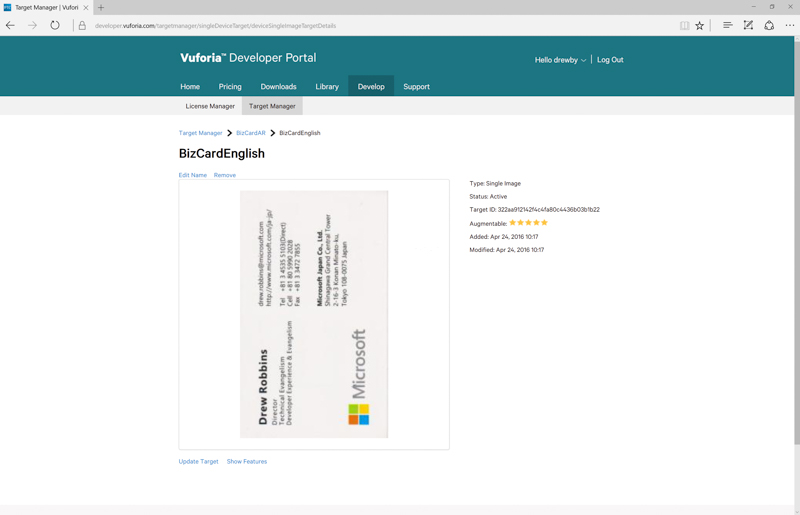](images/VuforiaTargetExample-large.png)

1. Once you have added all of your targets, you can click *Download Database (All)*. Select *Unity Editor* and click *Download*. Save the resulting .unitypackage file to a local folder.

You now have all the assets that you need to get started with your augmented reality project.

## Create the initial project and import assets

Our next step is to create our Unity project and the initial scene that will define our augmented reality experience.

1. Launch Unity and create a new 3D project. Provide the *Project name* and choose a *Location* for your poject click *Create project*. You will have the default scene show in the Unity editor with a Main Camera and Directional Light.

    [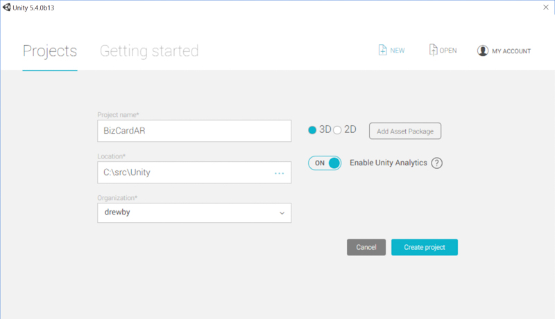](images/UnityNewProject-large.png)

1. Import the Vuforia unity package. Click the *Assets* menu and select *Import Package > Custom Package...* Locate the first .unitypackage file you downloaded from the Vuforia developer portal, which contains the Vuforia platform. Choose to import *All* (the default) and click *Import*.

    [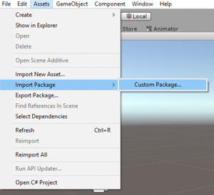](images/ImportPackage-large.png)

1. Import the Target database. Repeat the previous step, but this time import the .unitypackage file you downloaded from Target Manager on the Vuforia developer portal.

1. Save the current scene by clicking *File -> Save Scene* or typing Ctrl-S. Give the scene file a name and click *Save*.

Now you have an initial Unity project and scene. In addition, the Vuforia features are integrated into the project and we are ready to build our experience.

## Create the AR camera and image targets

Now we will use the Vuforia prefab objects to create a 3D scene that defines our augmented reality experience. In case you are new to Unity, here is a brief overview of what you should see. This assumes you have not previously launched Unity and moved any tools windows around.

* On the left side of the Unity tool, you will see the *Scene* window with your scene containing two objects. A camera and a directional light.

* Above the Scene window, you will find several buttons called the *Scene control tools*. The first one is a hand which allows you to move the scene around in the view. Try click and dragging the scene with your mouse. You can also hold down the Alt key, then click and drag to rotate the scene. Finally, you can use your scroll wheel to zoom in and out of teh scene. The other control tools are used for moving objects in the scene.

* To the right of the *Scene* window is the *Heirarchy* window. This represents a tree view of the various objects that are in your scene. This allows you to select the objects as well as move their position in the tree. Each child object is created and manipulated relative to its parent. You will see this in action later.

* Below the *Heirarchy* window is the *Project* view. This tree view contains all the assets avaiable in your project categorized into folders. In your project, you should see the Vuforia folder which contains the platform assets you imported earlier.

* Finally, to the far right of the Unity tool, you should see the *Inspector* window. Sometimes the *Services* window is showing, so just click the tab at the top that says *Inspector* to show the correct window. This window is used to inspect and manipulate all of the various settings of your objects in your scene or in the project.

    [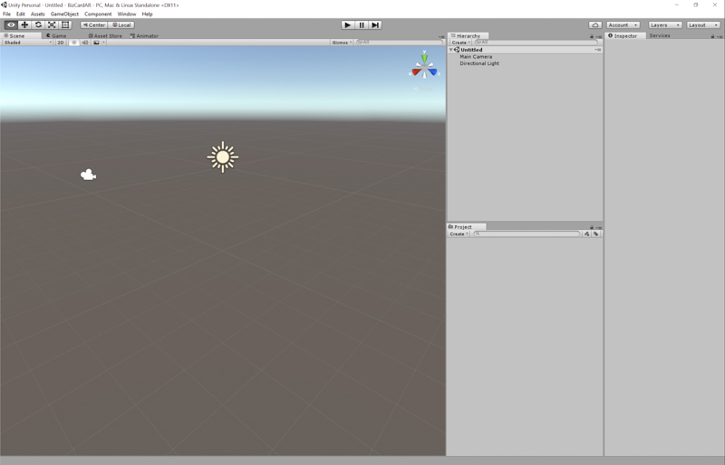](images/UnityDefaultScene-large.png)

You now have very brief understanding of the Unity tool. If you want to learn more, try this [Interface Overview video](http://unity3d.com/learn/tutorials/modules/beginner/editor/interface-overview?playlist=17090 "Interface Overview tutorial"). Let's now make several modifications to our scene.

### Create an AR camera

1. The first step is to delete the *Main Camera* in the scene. Locate the *Main Camera* in the *Hierarchy* window. Right-click *Main Camera* and click *Delete*.

1. Now we will add the AR Camera from Vuforia. In the *Project* window, expand the *Vuforia* folder and then expand the *Prefabs* folder. Prefabs in Unity are preconfigured objects with some characteristics and functionality already defined. In this case, the *AR Camera* is a modified camera with the Vuforia AR functionality built in.

    [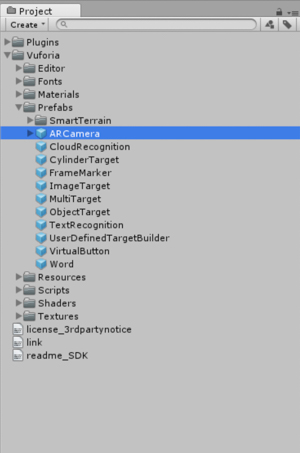](images/ARCamera-large.png)

1. Drag the *AR Camera* up to the *Hierarchy* window and drop it anywhere in the window. This will create an *AR Camera* in the hierarchy and you should see it appear in the scene.

1. Select the newly created *AR Camera*. The *Inspector* window will show the settings for several components of the *AR Camera*. Find *Vuforia Behaviour* and click on *App License Key*. You will need to copy and paste your license key from the Vuforia developer portal to this setting.

    

### Create image targets

You now have an AR camera in your scene. The next step is to create Image Targets. These will be objects in your scene used to represent the detected images you scanned and put in your target database. These targets will not show in the live view of your scene. Rather the will provide a center for the other objects to orient around once your target is detected.

1. In the *Project* window, locate the Vuforia prefab called *ImageTarget*.

    [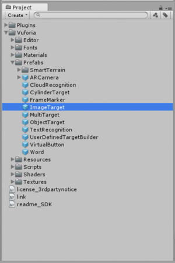](images/ImageTarget-large.png)

1. Drag *ImageTarget* to the *Heirarchy* window and drop it into scene.

1. Select the new *ImageTarget* so that it's settings who in the *Inspector* window.

1. Raname this *ImageTarget* so you can identify it later. For example, I renamed mine to BizCardEnglish.

1. Find the *Image Target Behaviour* component and change *Database* to your imported target database. Select the correct *Image Target* for this object. In my project, it is the English side of my Business Card.

    [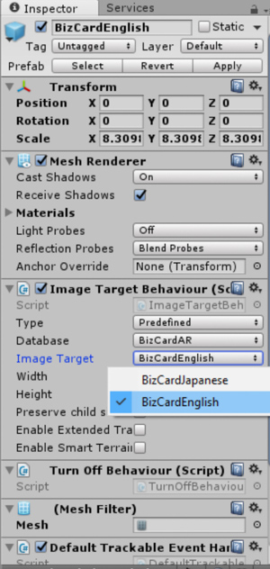](images/ImageTargetInspector-large.png)

1. Drag another *ImageTarget* from the *Project* window to the *Heirarchy* window. Rename this *ImageTarget* (BizCardJapanese) and repeat the step to select *Database* and *Image Target* in the *Inspector* window.

1. You have two image targets, one covering the other in the scene. To make this easier to work with, adjust the *X* *Position* of the second image target in the *Inspector* window. I adjusted my BizCardJapanese with X Position of 7.

1. Save the current scene by clicking *File -> Save Scene* or typing Ctrl-S.

Now I have two Image Targets in my scene, which look like two business cards side-by-side in the scene. Vuforia is ready to detect these Image Targets, but does not yet know what to do with them.

[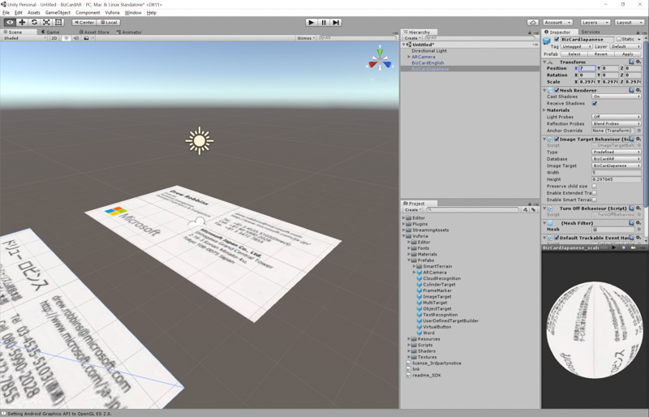](images/FirstScene-large.png)

Next, lets add some augmented experience to these cards.

## Create an augmented experience using our image targets

The first experience we will create will be a simple one, using basic 3D models.

1. In the *Heirarchy* window, right-click your first Image Target (BizCardEnglish), select *3D Object -> Cube*. This will create a Cube in the scene, but we need to adjust it's size and position.

    [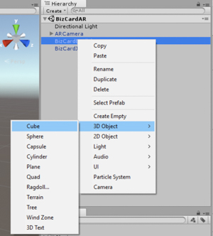](images/CreateCube-large.png)

1. Select the new Cube object so that it's settings are shown in the *Inspector* window.

1. Adjust the Scale of the object by changing *Scale* *X*, *Y*, and *Z* to 0.25.

1. Then adjust the *Position* *Y* setting to 0.5 so that the cube hovers above the Image Target.

1. Right-click the second Image Target (BizCardJapanese) and select *3D Object -> Sphere*.

1. Again, adjust the Sphere settings so that it's scale is 0.25 and Y position is 0.5 so it hovers above the second Image Target.

[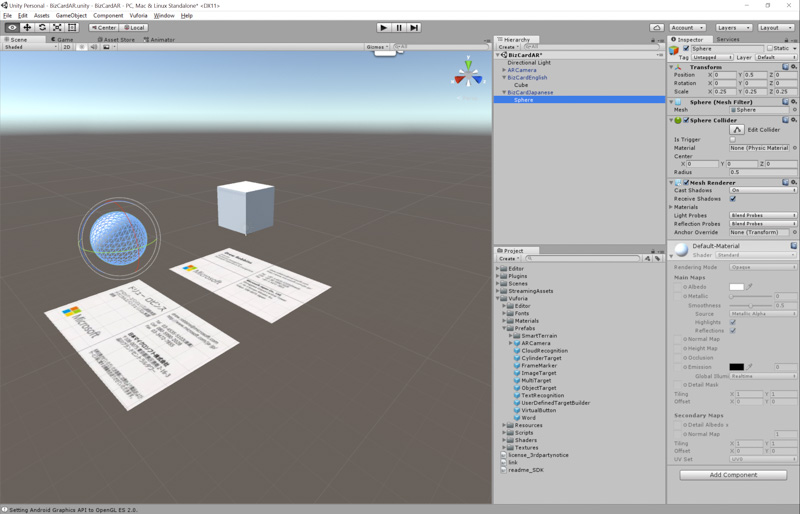](images/FirstARScene-large.png)

### Try your first AR experience

Before we click the Play button and preview this experience, there are a few more settings to choose for the AR Camera.

1. In the *Heirarchy* window, select AR Camera so its settings show in the *Inspector* window.

1. In the *Inspector* window. locate the component *Web Cam Behaviour*. Choose the appropriate *Camera Device*. For example, you may have a front camera and rear camera.

    [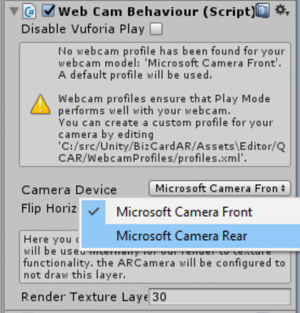](images/ARCameraSettings1-large.png)

1. Now find the *Database Load Behaviour* component. Check the box next to Load Named Database (where Named is replaced with your Vuforia Database). Also check the box *Activate* which appears after selecting your database.

    [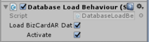](images/ARCameraSettings2-large.png)

1. Finally, if you want more than one Image to be detected at a time, then adjust the *Max Simultaneous Tracked Images" setting to 2 or more in the *Vuforia Behaviour* component.

1. Save the current scene by clicking *File -> Save Scene* or typing Ctrl-S.

Now you are ready to try this AR experience.

1. Above the *Scene* window, you will see a Play button. Click this button to start previewing your scene.

1. If everything is working, you will see the video from your selected camera in the *Game* window.

1. Try placing your first image target in the field of view. Once Vuforia detects the image, it will render the Sphere or Cube over the image target just as we designed.

1. Press the Play button again to stop the preview.

    [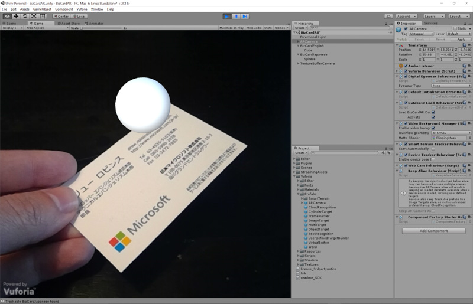](images/Simple3DObjectAR-large.png)

Assuming everything worked, that was pretty cool! Right? But it will be even better if we place some 3D animated objects in the scene.

## Place a 3D animated object in the scene

Now we need to get a 3D animated object. Unity has an Asset Store for artists and developers to share, buy and sell various Unity assets. *We will use a specific Animation package below, but you can browse trough the Asset store and find other packages.*

1. To open the store, click the *Window* menu and select *Asset Store*.

1. In the *Asset Store* window, enter *"Action Pack"* with the quotes into the search box.

1. In the search results, you can select "Free Only" to locate only free packages.

1. Look for the *"Action Pack"* Animation package from 3D-Brothers. Click the package to open and preview.

    [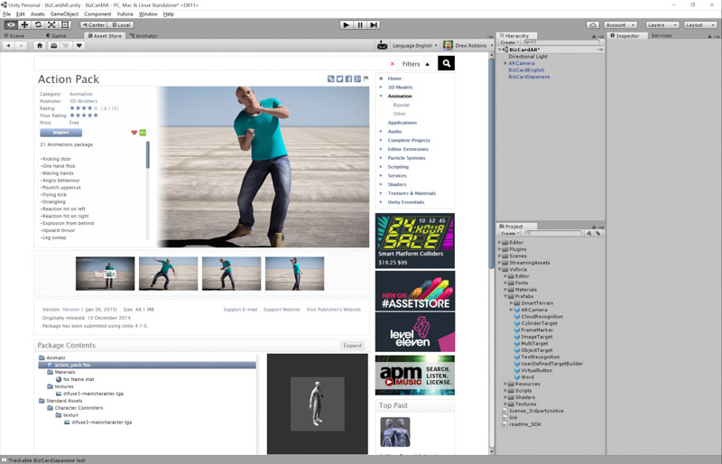](images/AssetStore-large.png)

1. Click the *Import* button to bring this package into your Unity project. This import process took several minutes on my machine. Be patient. :)

### Add the new 3D object to your scene

1. First, right-click both the *Cube* and the *Sphere* you created earlier and *Delete* them.

1. In the *Project* window, expand Animatii and note the *action_pack* import settings object.

1. Drag *action_pack* onto one of your image targets in the *Heirarchy* window. Drop it on the image target so that it becomes a child of the image target object.

1. Select the new action_pack object in the *Heirarchy* window and adjust its Scale something relative to your image target. I adjusted *X*, *Y*, and *Z* to 0.5 in my scene.

    [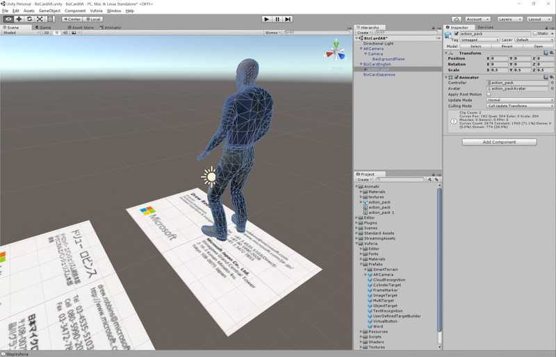](images/ActionPackObject-large.png)

1. Press Play and preview your poject.

You should now see this new 3D character object where you previously saw a primitive object. But it's not moving. Let's fix that.

### Animate the 3D object

Stop the preview by pressing Play. Let's add some animation.

1. In the *Project* window, expand *Animatii* and expand *action_pack*. Below *action_pack* you will see several objects with "play" icons which represent animations.

1. Click *angry beheivor* animation. In the *Inspector* window, you will see a preview window for this animation. Press Play in the *Inspector* window to see how angry beheivor will look.

1. Now drag the *angry beheivor* animation up to the *Heirarchy* window and drop it onto our *action_pack* child object.

1. You can preview the scene again and now see the animated 3D object over your image target.

### Modify the animation sequence

You now have a 3D animated object in the scene. However, once the animation completes, the 3D object will be still again. There are many ways to fix this, but one easy way is to create a rotating sequence using the Animator window.

1. Select the *action_pack* object which is a child of your image target in the *Heirarchy* window.

1. Click the *Window* menu and select *Animator*. You will see a simple animation sequence containing just one animation, the *angry beheivor* animation.

1. From  the *Project* window, drag the *punching bag* animation into the *Animator* window and drop it on the canvas.

1. Right-click *angry beheivor* and select *Make Transition*. Move your mouse over to *punching bag* and click to create the transition.

1. Now Right-click *punching bag* and select *Make Transition*. Move your mouse over to *angry beheivor* and click to create the transition.

    [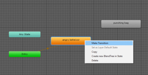](images/Animator-large.png)

1. Save the current scene by clicking *File -> Save Scene* or typing Ctrl-S.

1. We now have an endless loop for our animation sequence. Click Play and preview it in the Unity tool.

### Add another 3D object

Use the same steps, to add another copy of the 3D object to the other image target.
Choose a different animation and use the animator to make this character act differently.

Or you can download additional 3D assets from the Asset store to have a varity of models in your scense. Then make them face each other in the preview so they appear to be fighting.

[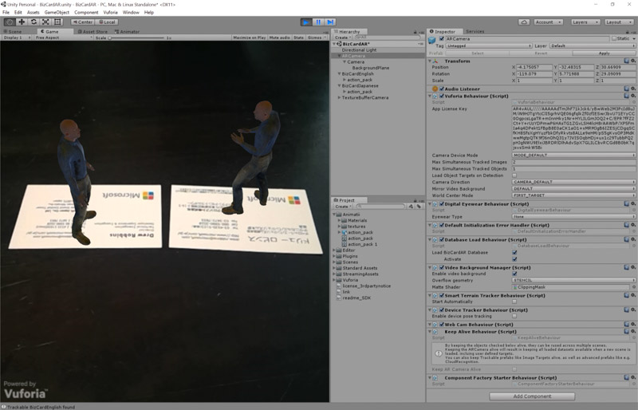](images/CompletedScene-large.png)

## What's next

I hope you enjoyed this short tutorial. Unity and Vuforia have a termendous amount of other functionality not covered here. You could use Unity to get objects to interact in your AR experience, or use more complex Vuforia targets to detect 3D objects in the scene.

If you have any feedback or want to make some additions, feel free to fork the repro and do a pull request.

Have fun!
